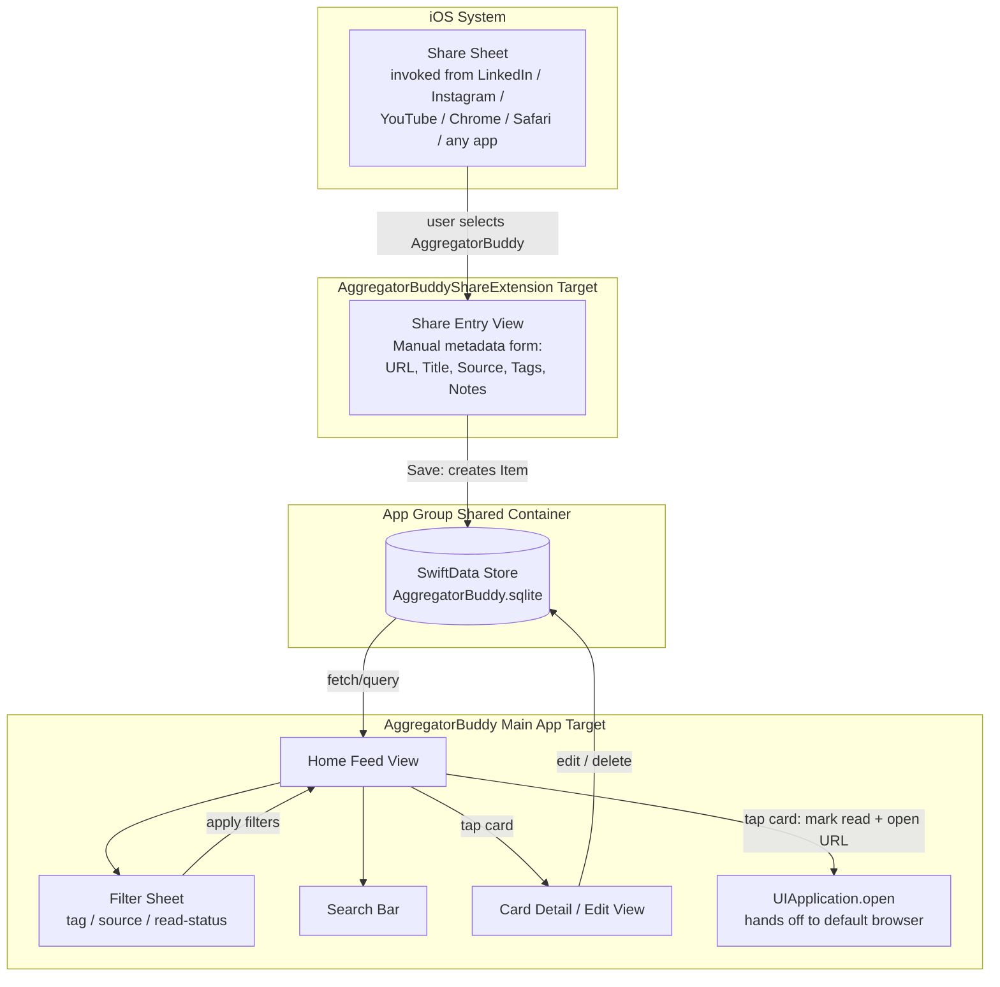
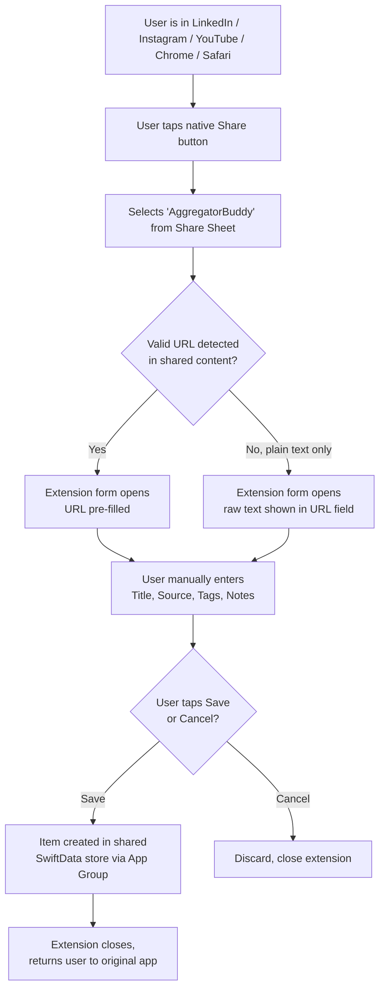
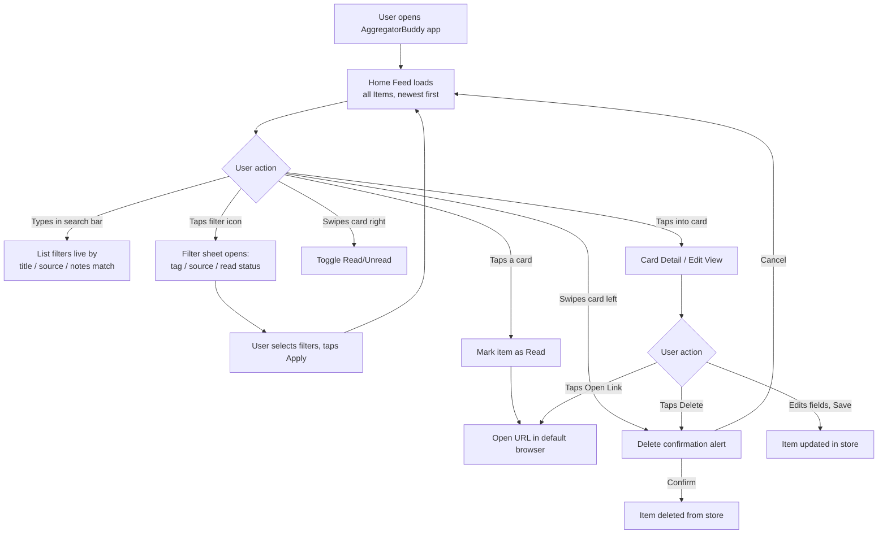

# AggregatorBuddy — Technical Build Spec (Phase 1)

## 1. Overview

**App name:** AggregatorBuddy
**Platform:** iOS (SwiftUI, iOS 17+)
**Purpose:** Let the user save links shared from any app (LinkedIn, Instagram, YouTube, Safari/Chrome, etc.) via the native iOS Share Sheet. Each saved link becomes a "card" with manually entered metadata (title, source, tags). User can browse, search, filter, mark read/unread, and delete cards. Tapping a card hands off to the default browser to open the link.

**Phase 1 scope (explicitly locked):**
- Manual metadata entry only — no auto-fetch of title/thumbnail/OG data
- No smart/suggested tagging
- No notifications/nudges/reminders
- Local storage only — no cloud sync, no accounts, no login
- Opening a link hands off to the default browser (Safari) — no in-app browser

**Explicitly out of scope for Phase 1** (do not build):
- iCloud/CloudKit sync
- Push notifications
- Auto-metadata scraping (OpenGraph, favicons, etc.)
- ML/rule-based tag suggestions
- Multi-device support
- Android version
- User accounts/auth

---

## 2. Architecture

- **UI Framework:** SwiftUI
- **Persistence:** SwiftData (local only, no CloudKit container)
- **Minimum iOS version:** iOS 17.0 (required for SwiftData)
- **Targets in the Xcode project:**
  1. `AggregatorBuddy` — main app target
  2. `AggregatorBuddyShareExtension` — Share Extension target (appears in the iOS Share Sheet)
- **Data sharing between targets:** App Group container (required — the Share Extension and main app run in separate sandboxes and cannot share a normal SwiftData store without this)

### 2.1 App Group Setup
- Create an App Group identifier, e.g. `group.com.<yourdomain>.aggregatorbuddy`
- Enable "App Groups" capability on **both** targets (main app + share extension) in Xcode → Signing & Capabilities
- Point the SwiftData `ModelContainer` at the shared container URL:
  ```swift
  let containerURL = FileManager.default
      .containerURL(forSecurityApplicationGroupIdentifier: "group.com.<yourdomain>.aggregatorbuddy")!
      .appendingPathComponent("AggregatorBuddy.sqlite")

  let config = ModelConfiguration(url: containerURL)
  let container = try ModelContainer(for: Item.self, configurations: config)
  ```
- Both the main app and the Share Extension must use this **same** `ModelConfiguration` so writes from the extension are visible in the main app.

### 2.2 High-Level Design (HLD)



**Key points the diagram makes explicit:**
- The Share Extension and the Main App are **separate processes/sandboxes** — the only thing connecting them is the shared SwiftData store living in the **App Group container**.
- No network layer exists anywhere in this design — every arrow is either a local UI interaction or a local database read/write, except the final hand-off to the external browser app.

---

## 3. Data Model

Use SwiftData `@Model` classes.

```swift
import SwiftData
import Foundation

@Model
final class Item {
    var id: UUID
    var url: String
    var title: String
    var source: String        // free-text, e.g. "LinkedIn", "YouTube", "Article"
    var notes: String?        // optional, manual
    var dateAdded: Date
    var isRead: Bool
    var tags: [String]        // simple string array for Phase 1 (see note below)

    init(
        id: UUID = UUID(),
        url: String,
        title: String,
        source: String,
        notes: String? = nil,
        dateAdded: Date = .now,
        isRead: Bool = false,
        tags: [String] = []
    ) {
        self.id = id
        self.url = url
        self.title = title
        self.source = source
        self.notes = notes
        self.dateAdded = dateAdded
        self.isRead = isRead
        self.tags = tags
    }
}
```

**Decision: tags are stored as a simple `[String]` on `Item`** (as modeled above). No separate `Tag` entity/relationship for Phase 1. When filtering by tag, fetch items and filter in-memory on the `tags` array (see note in Section 4.3) rather than relying on SwiftData predicate array-contains support.

---

## 4. Feature Spec

### 4.1 Share Extension (Capture Flow)

**Trigger:** User taps "Share" in any app (Safari, Chrome, LinkedIn, Instagram, YouTube, etc.) on a URL, then selects "AggregatorBuddy" from the share sheet.

**Behavior:**
1. Extension receives the shared URL via `NSExtensionItem` / `NSItemProvider` (type `public.url` or `public.plain-text` fallback for apps that share text containing a link).
2. Present a form sheet (SwiftUI view hosted in the extension) with fields:
   - **URL** — pre-filled, read-only or editable text field
   - **Title** — text field, empty by default, user types manually
   - **Source** — text field (free text; user types "LinkedIn", "YouTube", etc. manually — no dropdown needed for Phase 1, but a simple autocomplete from previously used sources is a nice-to-have, not required)
   - **Tags** — text field supporting comma-separated tag entry (e.g. "tech, spiritual, must-read"); trim whitespace, split on comma, lowercase for consistency (case-insensitive matching), dedupe
   - **Notes** — optional multi-line text field
3. Two actions: **Save** and **Cancel**.
   - Save → creates an `Item` in the shared SwiftData store, then closes the extension (`extensionContext?.completeRequest`)
   - Cancel → discards and closes (`extensionContext?.cancelRequest`)
4. No network calls, no metadata fetching — purely manual entry as specified.

**Edge cases to handle:**
- Shared content has no valid URL (e.g., some apps share plain text) → still allow saving as a plain-text "clipping" if URL parsing fails, or show a clear error. Decide: for Phase 1, if no valid URL is found, show the raw shared text in the URL field so user can still tag/save it (some Instagram/LinkedIn shares are text+link combined — extract with a simple regex URL detector; if `NSDataDetector` finds no link, just show text).
- Title field left empty on save → default to the URL string or "Untitled" as fallback.

### 4.2 Home Feed (Main App)

**Layout:** Scrollable list of cards, newest first by default (`dateAdded` descending).

**Each card displays:**
- Title (bold, truncated to 2 lines)
- Source (small label/badge)
- Date added (absolute format, e.g. "Sep 18, 2026" — use a consistent `DateFormatter` style, e.g. `.abbreviated` or `medium`, across the whole app)
- Tags (as small pill/chip views, horizontally scrollable if many)
- Read/unread indicator (e.g. dot, bold vs. regular title weight, or a badge)

**Card interactions:**
- **Tap card** → opens the URL in the default browser via `UIApplication.shared.open(url)`, and marks item as read automatically on open
- **Swipe actions:**
  - Swipe right (or leading) → toggle Read/Unread
  - Swipe left (or trailing) → Delete (with confirmation, since delete is destructive)
- **Long-press or tap-into-detail (optional but recommended)** → opens a detail/edit view showing full title, URL, source, tags, notes, with ability to edit any field and delete from there too

### 4.3 Search & Filter

**Required for Phase 1.**

- **Search bar** at top of Home Feed — searches across `title`, `source`, and `notes` (case-insensitive substring match). Live-filter as user types.
- **Filter controls: presented as a sheet.** A filter icon/button (e.g. toolbar icon) opens a modal sheet containing:
  - **By tag** — multi-select from list of all distinct tags currently in use
  - **By source** — multi-select or dropdown from list of all distinct sources currently in use
  - **By read status** — segmented control: All / Unread / Read
  - "Apply" and "Clear filters" actions within the sheet
- Filters should be combinable (e.g., tag = "tech" AND status = "Unread" AND search text = "swift")
- Show active filter count as a badge on the filter icon when any filter is applied (e.g., a small numeral badge), so the user knows filters are active without opening the sheet

**Implementation note:** With SwiftData, use `#Predicate` for filtering combined with in-memory filtering for tag arrays if using the simple `[String]` model (SwiftData predicates have some limitations on array `contains` — verify at build time; if predicates on `[String]` tags prove unreliable, filter in-memory after fetching, which is fine at Phase 1 data volumes).

### 4.4 Card Detail / Edit View (included in Phase 1)

- Shows all fields: URL, Title, Source, Tags, Notes, Date Added, Read status
- Allows editing any field and saving changes
- Delete button (with confirmation alert)
- "Open Link" button as an alternative to tapping the card in the list

### 4.5 Delete

- Available via swipe action on card, and in detail view
- Always confirm destructive delete with an alert ("Delete this item? This cannot be undone.")
- No trash/undo needed for Phase 1 (soft-delete is a nice-to-have for later phases, not required now)

---

## 5. User Flow Diagram

### 5.1 Capture Flow (Share Extension)



### 5.2 Browse / Organize Flow (Main App)



---

## 6. Screens Summary

| Screen | Purpose |
|---|---|
| Share Extension Sheet | Manual metadata entry on capture |
| Home Feed | List of all cards, sorted newest-first |
| Search/Filter Bar | Search text + tag/source/read-status filters |
| Card Detail | View/edit full item, delete |
| Empty State | Shown when no items exist yet — brief instructional text like "Share a link from any app to get started" |

---

## 7. Non-Functional Requirements

- **Performance:** Should comfortably handle a few thousand items without lag (typical local SwiftData query performance; no special optimization needed at Phase 1 scale).
- **Offline:** Fully offline — no network permissions required in Phase 1 (no metadata fetching, no sync).
- **Privacy:** No analytics, no third-party SDKs required. Local storage means Apple's standard on-device sandbox protections apply. No special privacy manifest entries needed beyond Xcode defaults, since there's no tracking/network data collection.
- **Accessibility:** Use standard SwiftUI components so VoiceOver/Dynamic Type work by default; avoid custom-drawn text that bypasses accessibility.

---

## 8. Suggested File/Project Structure

```
AggregatorBuddy/
├── AggregatorBuddyApp.swift          (App entry, ModelContainer setup)
├── Models/
│   └── Item.swift
├── Views/
│   ├── HomeFeedView.swift
│   ├── CardView.swift
│   ├── FilterBarView.swift
│   ├── ItemDetailView.swift
│   └── EmptyStateView.swift
├── Extensions/
│   └── URL+Helpers.swift             (open in browser, URL validation)
└── Shared/
    └── AppGroupConfig.swift          (App Group ID constant, shared ModelContainer factory)

AggregatorBuddyShareExtension/
├── ShareViewController.swift          (or SwiftUI-hosted extension entry)
├── ShareEntryView.swift               (the manual metadata form)
└── Info.plist                         (NSExtension activation rules: accept public.url, public.plain-text)
```

---

## 9. Acceptance Criteria (Definition of Done for Phase 1)

- [ ] User can share a URL from Safari/Chrome/LinkedIn/Instagram/YouTube (or any app with a share sheet) to AggregatorBuddy
- [ ] Share sheet form lets user manually enter title, source, tags (comma-separated), and optional notes before saving
- [ ] Saved items appear immediately in the Home Feed (app doesn't need to be relaunched)
- [ ] Cards show title, source, date, tags, and read/unread state
- [ ] Tapping a card opens the link in the default browser and marks it read
- [ ] User can manually toggle read/unread
- [ ] User can delete an item, with confirmation
- [ ] User can search by text across title/source/notes
- [ ] User can open a filter sheet and filter by tag, source, and read status, in combination, with a badge indicating active filters
- [ ] User can open a Card Detail view to see/edit full item fields and delete from there
- [ ] All data persists locally across app restarts (SwiftData)
- [ ] No network calls are made anywhere in the app (verify with no unexpected entries in Info.plist's network usage or App Transport Security exceptions)

---

## 10. Decisions Log (finalized)

| Decision | Choice |
|---|---|
| Tag storage | Simple `[String]` on `Item` |
| Date display on cards | Absolute format |
| Filter UI | Modal sheet, triggered by a filter icon |
| Card Detail/Edit view | Included in Phase 1 |

No open decisions remain — this spec is ready to build as-is.
